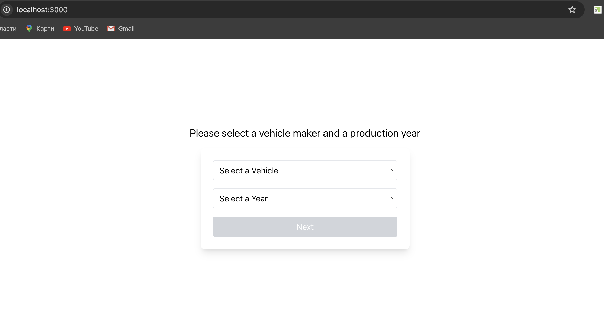
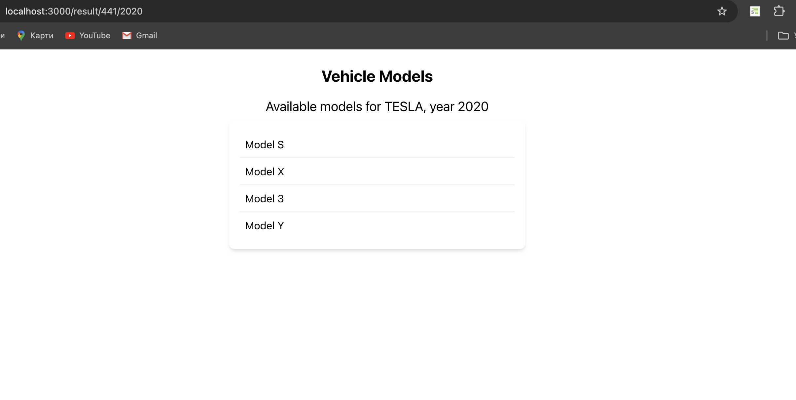

# Vehicle Models Selection App

## Overview
This is a Next.js application that allows users to select a vehicle make and model year to retrieve available vehicle models from the API.

## Features
- Fetches vehicle makes and models dynamically.
- Uses Suspense for data fetching with a loading state.
- Implements proper error handling to display meaningful messages to users.
- Navigates to a dynamic results page.

## Installation & Setup

### Prerequisites
Make sure you have the following installed:
- [Node.js](https://nodejs.org/) (LTS version recommended)
- [Yarn](https://yarnpkg.com/) or [npm](https://www.npmjs.com/)

### Clone the Repository
```sh
git clone https://github.com/Oleksii-Mishchenko/car-dealer-app.git
cd car-dealer-app
```

### Install Dependencies
```sh
yarn install
# or
npm install
```

### Environment Variables
`.env.local` file is in the root directory and has the following variables:
```
NEXT_PUBLIC_CURRENT_YEAR=2025
NEXT_PUBLIC_START_YEAR=2015
```

### Run the Development Server
```sh
yarn dev
# or
npm run dev
```
Open [http://localhost:3000](http://localhost:3000) in your browser.

## Application Structure
```
📂 app/
 ┣ 📂 components/        # Reusable UI components
 ┣ 📂 result/            # Dynamic route for vehicle models
 ┣ 📜 layout.tsx        # Main layout
 ┣ 📜 page.tsx          # Home page
 ┣ 📜 error.tsx         # Global error component
```

## Screenshots
### Home Page


### Vehicle Models Page


## API Usage
The app fetches data from the [API](https://vpic.nhtsa.dot.gov/api/):
- Fetch makes: `https://vpic.nhtsa.dot.gov/api/vehicles/GetMakesForVehicleType/car?format=json`
- Fetch models: `https://vpic.nhtsa.dot.gov/api/vehicles/GetModelsForMakeIdYear/makeId/{makeId}/modelyear/{year}?format=json`

## Error Handling
- If an API request fails, an error message is displayed.
- If no models are found for the selected year, a message is shown instead of an empty list.

## Contributing
Feel free to fork the repo and submit pull requests.
